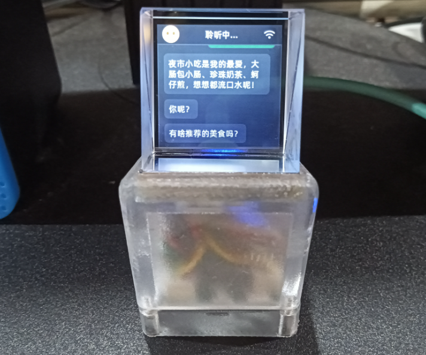
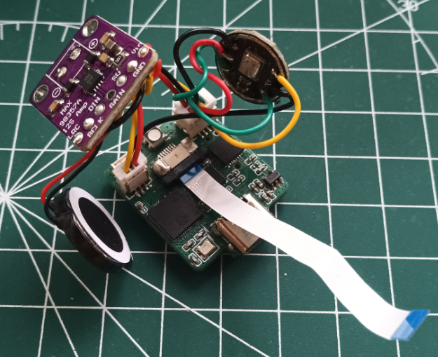
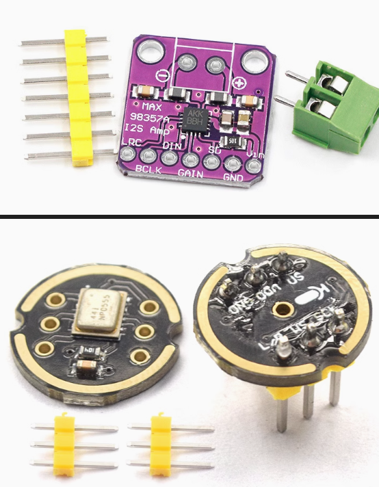
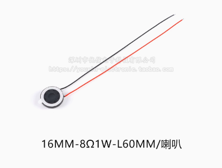
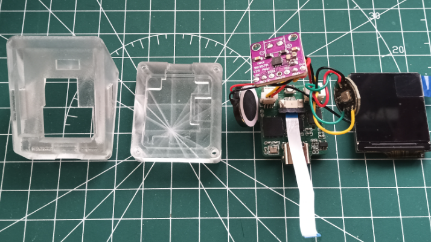
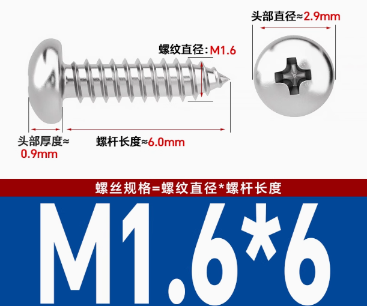

# HoloCubicS3(AI语音版)

## 项目介绍
这是HoloCubic的AI语音版本。刚开始其实只是想让HoloCubic播放有声的音视频，在原版的基础上添加麦克风和扬声器的接口。但后面小智AI爆火后，希望可以制作一个可以跑小智AI的HoloCubic。
>由于用到ESP32S3主控芯片，所以项目名称改为HoloCubicS3，用于区分原版。

### 下面从硬件、固件、软件、结构4个方面进一步介绍。

## 1.硬件
硬件我主要讲一下与原版的差异点。


### 1.1 主控选型
主控从ESP32-PICO-D4换成了性能更好，内存更大的ESP32S3。型号是ESP32S3R8,一样是QFN封装的芯片，它内置了8MB PSRAM，所以内存肯定是够用了。
>当然，还需要外挂一块SPI FLASH用来存放代码，这里我选用了一块8MB的SPI FLASH，感觉应该够用了。如果有容量要求，也可以选用容量更大的16MB的SPI FLASH。

### 1.2 语音拓展
语音拓展我这里用了比较偷懒的办法,就是直接在主板上留出2个I2S接口，搭配网上购买的MAX98357音频功放板和INMP441全向麦克风模块来实现的,这两个模块好像在
创客圈里经常被拿来使用，所以这里就选了这两个模块。


喇叭这里使用的是16MM-8Ω 1W-L60MM的小喇叭。


>注: INMP441上的L/R是左右声道选择端，我程序里面是用了左声道，需要把该L/R端接到GND。MAX98357的VDD选择接5V，这样可以减少播放音频中的噪声。

### 1.3 SD卡座修改
原版的SD卡座没有自弹功能,而且每次取出SD卡都要先拧出下壳的螺丝，打开下壳，拿出主板才能取出。我觉得这点比较麻烦，不够优雅。考虑到需要用来播放音视频，可能需要频繁取出SD卡来更换音频和视频素材，所以修改了SD卡座为带自弹功能的。

### 1.4 USB转串口芯片修改
原来的CP2102芯片比较贵，所以修改为更便宜的国产CH9102X芯片，两块芯片的封装是pin to pin的，方便随时替换。
>如果想省成本可以换成使用CH9102X，想性能稳定可以用回CP2102。

## 2.固件
固件方面目前适配了以下3个开源项目：
* **小智AI**：可以用来作为AI语音聊天机器人。
* **MiniTV**：可以用来播放音视频。
* **HoloCubic AIO**：这个固件其实还没完全适配好，会有重启的问题，这里我也开源了，如果有能力同学的也可以修复完善一下。

>其中开发小智AI的IDE我是使用VSCode + ESP-IDF插件来开发的，ESP-IDF版本是v5.3.2。
开发MiniTV和HoloCubic AIO的IDE是使用VSCode + Platformio插件来开发的，当然也可以换成Arduino IDE。

## 3.软件
如果需要播放音视频，就需要用到ffmpeg这个开源软件把原始的视频转换出音频和视频文件。
这个软件使用时把软件目录下的bin目录添加到系统环境变量可以更方便的使用。如我添加到环境变量的目录是:
```
D:\ffmpeg-2025-03-31-git-35c091f4b7-essentials_build\bin
```
然后就可以使用命令行提示符，进入需要转换的视频所在的目录，依次输入以下指令来转换视频和音频。为了方便，我把视频名称改成了input.mp4。


### AAC Audio

#### 44.1 kHz Mono

```
ffmpeg -i input.mp4 -ar 44100 -ac 1 -ab 24k -filter:a loudnorm -filter:a "volume=-5dB" 44100.aac
```

### MP3 Audio

#### 44.1 kHz Mono

```
ffmpeg -i input.mp4 -ar 44100 -ac 1 -ab 32k -filter:a loudnorm -filter:a "volume=-5dB" 44100.mp3
```
>上面的AAC音频和MP3音频是二选一，选择其中一种格式转换就行。
### MJPEG Video

#### 240x240@30fps

```
ffmpeg -i input.mp4 -vf "fps=30,scale=-1:240:flags=lanczos,crop=240:in_h:(in_w-240)/2:0" -q:v 11 240_30fps.mjpeg
```

## 4.结构
结构分为上壳和下壳，上壳我把里面的空间扩大了，方便塞下音频功放板和麦克风模块。下壳的侧面还留出了一个SD的卡槽，方便随时取下SD卡修改SD卡的内容。


上下壳我是使用螺丝固定的，型号是M1.6*6


## 5.开源致谢
感谢以下开源项目:

https://github.com/peng-zhihui/HoloCubic

https://github.com/78/xiaozhi-esp32

https://github.com/moononournation/MiniTV

https://github.com/ClimbSnail/HoloCubic_AIO